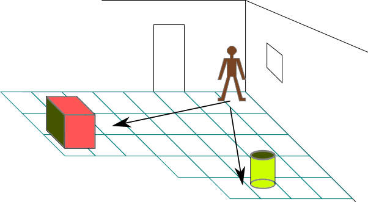

# Eskalè

Yon eskalè se yon nonb reyèl, sa vle di yon eleman nan ansanm $$\mathbb{R}$$. Ansanm sa konprann chif natirel yo tankou 1, 2, 3, fraksyon, chif ak vigil, epi nom yo rele nom irasyonel tankou

$$ \pi=3.14159... $$

> 

Eskalè yo obeyi anba lwa operasyon aljèb nou abitye yo, tankou:

- **Adisyon**:    $$3 + 4 = 7$$

- **Soustraksyon**: $$7 - 3 = 4$$

- **Mitiplikasyon** $$6 \times 7 = 42$$

- **Divizyon**: $$\dfrac{12}{3} = 4$$

Yo ka itilize eskalè pou reprezante plizyè tip mezi:

- *Longè* : pa egzanp ki longè pye yon moun, ki wotè batiman an?
- *Tan* : ki kantite tan ki separe de evènman
- *Pwa ou byen mas* : ki kantite diri ki nan sak la?
- *Kouran*: konbyen anpè liy elektrik sa ka sipòte ?
- *Tanperati*: Kijan li fè cho ?
- elatriye… 

Si w ap mezire wotè yon moun, fòk ou di wotè a pa rapò ak yon inite, èske se mèt, èske se pye, pous ou byen lòn ? Si ou vle fouye, ou ka al gade lis inite yo itilize nan Fizik yo.

Gen anpil fwa, mezi yo konn bay gwo nonb ou byen nonb ki piti anpil, se pou sa syantifik yo renmen itilize yon jan pou ekri nonb ki rele notasyon syantifik.

Men eskalè pa sifi pou dekri tout bagay, pa egzanp nan desen sa kijan moun nan ki nan kwen pyès la ka di ki kote bwat la ak poubèl la ye ?

> 

Pou li fè sa, fòk li bay nan ki direksyon e nan ki distans bwat la ye pa rapò ak li ou byen pa rapò ak kwen sal la. Gen yon konsèp matematik ki mete yon sèl kote tou 2 enfòmasyon sa yo, ki rele [vektè](/maths/vector). Men n ap wè konsèp sa ka fè anpil lòt bagay toujou.